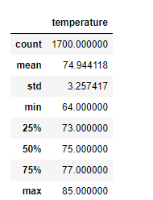
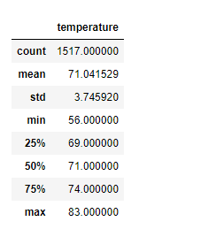

# Surfs_up
Weather analysis of the island of Oahu to plan for a Surf n' Shake shop. 
Using SQLite, SQLAlchemy, and Flask.

## Project Background
This analysis project focuses on studying the weather in the islands of Hawaii to construct a business plan for a Surf n' Shake store.  
The Surf n' Shake shop will be serving surfboards and ice cream to locals and tourists of the islands.  

While personal savings are available to invest in the business, having some actual investor baking would provide a solid base for the success and longevity of the project and enable a quicker initiation of the plan.  

W. Avy is a surfing enthusiast and businessman with access to substantial funds and can recruit his company's interest in investing in this shop if we can provide him with a sound analysis favoring sales sustainability regardless of seasonal weather changes.  

We plan to focus our efforts on the beautiful island of Oahu and study its weather trends concerning rain and temperature over the past few years, plus a direct comparison between midsummer and midwinter temperatures.  

We will provide the results in multiple graphs with a user-friendly URL for more detailed insight into the actual data.  

## Objectives
1. Analysis of the last 12 months of precipitation data from the island of Oahu, reflected in a plot of precipitation scores in chronological order. 
2. Determining the number of weather stations and the level of activity of each station. 
3. Identifying the most active weather station on the island to suggest the best location for the shop. 
4. Trend analysis of temperatures over a year based on Oahu's most active weather station data. 
5. Analysis of temperature trends for the month of June on the island.
6. Analysis of temperature trends for the month of December on the island. 
7. Creating a Flask application to share the findings via a URL. 

## Resources
- Data and Code: hawaii.sqlite, climate_analysis.ipynb, app.py, SurfsUp_Challenge.ipynb.
- Software: Python (3.7.11), VS code (1.66.2), Flask (2.1.1).
- Libraries and Packages: Jupyter notebook, SQLite, Matplotlib, SQLAlchemy. 
- Online Tools: GitHub, Flask application

## Results
1. There needs to be enough rain to keep everything green on the island of Oahu, but not so much that it jeopardizes that ideal surfing and ice cream weather:  
    - After analyzing a 12-month worth of precipitation data between August 23, 2016, and August 23, 2017,   it seems that Oahu is a great location for the new surf shop, judging on rain levels alone.  
      - Note: The count is the number of times precipitation was observed (2,021 times out of 2,230 observations).   
  
    - Looking at the precipitation trends on the island of Oahu for over a year, we can observe that, overall,   
 these are acceptable levels of rain, with just a few months having higher amounts than usual.  
   

2. After querying our weather dataset for stations information and grouping the results by stations' names, we find that:  
    - There are nine weather stations from which data was collected.  
    - These stations have provided a total of (19,550) weather recordings, and specifically, (2,230) recordings in the last year of the dataset,  
    between August 23, 2016, and August 23, 2017.  
    - The weather stations' IDs, along with their data contributions, are shown in the list below:  
   

3. From our previous query, we can determine that: 
    - The most active weather station on the island is station: "USC00519281", which has provided (2,772) data points.  
    - The summary of temperature recordings from that station is as follows:  

        |Min Temp (F)|Average Temp (F)|Max Temp (F)|
        |:---:|:---:|:---:|
        |54.0 |71.7 |85.0 |

4. Looking at the temperatures from the weather station with the highest number of observations over the last year of data shows that:  
    - In the vast majority of observations, about 325 days of the year, the temperature in Oahu was over (67)F.  
    - The temperature pattern from the Oahu station proves the eligibility of this island to house the Surf n' Shake shop.  
   

**Challenge: points 5 & 6**  
To determine if the surf and ice cream shop business is sustainable year-round, we focused our temperature analysis on two differential times of the year:  

5. Midsummer: we analyzed temperatures of the month of June over all the years in the weather dataset,  
    and we found there were (1,700) records showing an average temperature of (75)F over the years.  
    
    
6. Midwinter: when looking at the temperatures in December over the years, we found the average temperature to be (71)F.  
	  

7. Finally, we created a Flask application to facilitate shareholders' access to the analysis and relevant data.  
This URL allows the user to run the analysis locally on their computers and choose to inspect any point of interest from the data.  
[Flask application for Oahu's weather data analysis.](http://127.0.0.1:5000/)

## Summary and Recommendations
- Based on the weather analysis of data obtained from 9 weather stations on the island of Oahu, we can see that there's little difference   in temperatures between the  summer and winter seasons. 
- We conclude that the year-round warm temperatures and mild rains observed on this island for the past few years make it optimal for water sports like surfing. 
- We recommend Oahu to be the house of the first Surf n' Shake store. 
- The analysis schema used in this project can be replicated for other locations in the future to serve the expansion of the business. 
- Further analysis can be undertaken to compare precipitation levels between summer and winter on the island. 

